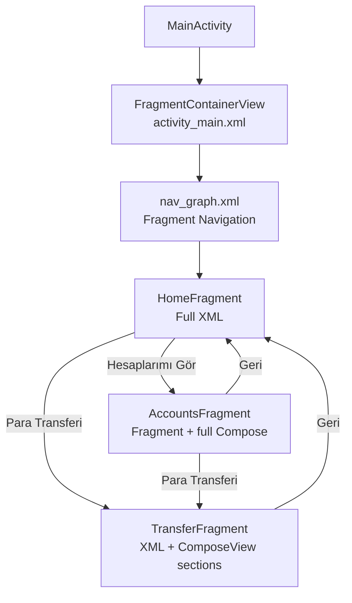
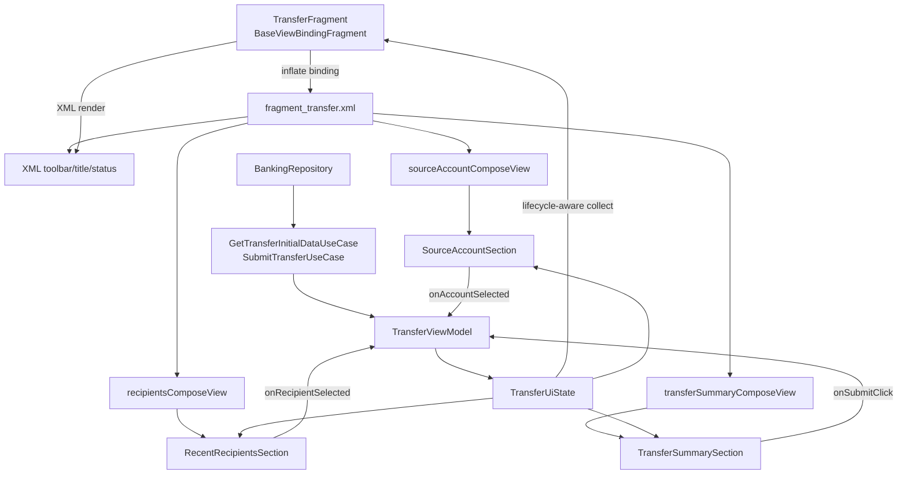
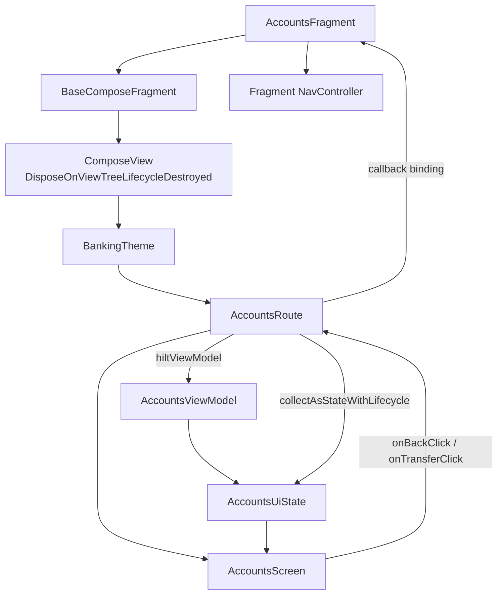
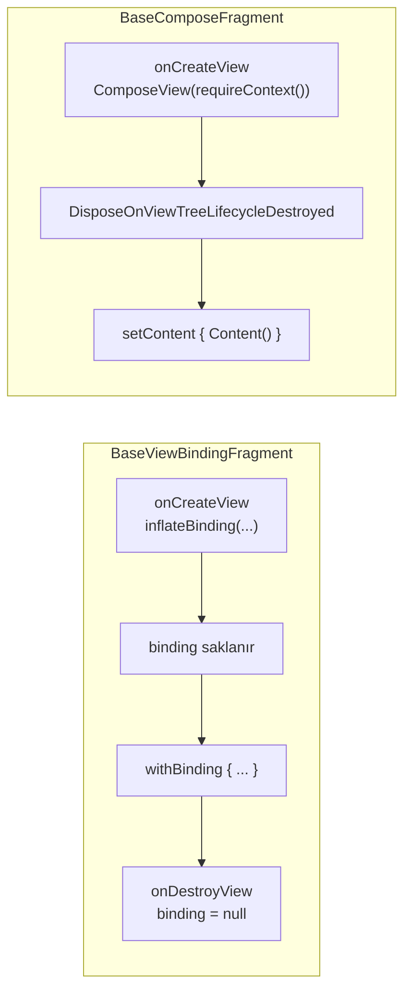
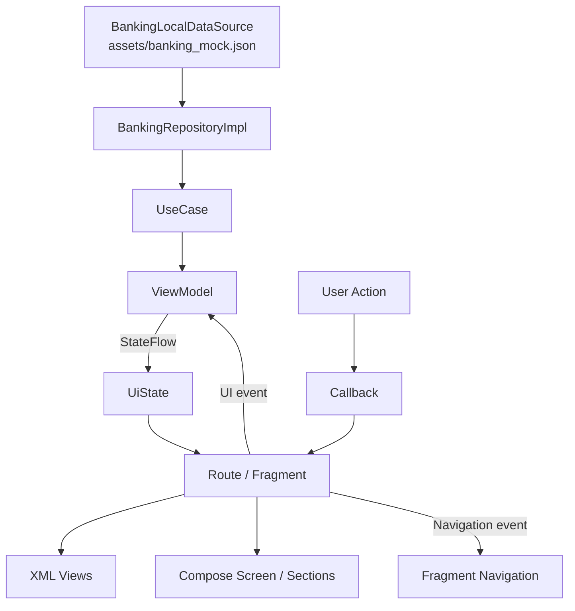

# Fragment/XML + Compose Migration Şemasının Codebase Uygulaması

Bu doküman, Fragment/XML + Compose migration şemasındaki kararların bu örnek bankacılık uygulamasında nasıl uygulandığını anlatır. Odak nokta UI tasarımı değil; Fragment Navigation, XML/Compose birlikte yaşama modeli, ViewModel kaynaklı state ve UDF sınırlarının codebase içinde nasıl konumlandığıdır.

## Ana Prensiplerin Codebase Karşılığı

- Fragment-based Navigation korunur: geçişler `app/src/main/res/navigation/nav_graph.xml` üzerinden yapılır.
- Shared screen state ViewModel'den gelir: `HomeViewModel`, `AccountsViewModel`, `TransferViewModel`.
- XML ve Compose birlikte yaşayabilir: `TransferFragment`, XML layout içinde birden fazla `ComposeView` host eder.
- Full Compose ekran Fragment host ile çalışabilir: `AccountsFragment`, `BaseComposeFragment` üzerinden Compose content döner.
- Binding lifecycle standardı merkezileştirilir: XML ve mixed ekranlar `BaseViewBindingFragment` ve `withBinding {}` kullanır.

## Migration Kararı -> Codebase Mapping

| HTML şemasındaki karar | Codebase karşılığı | Neden böyle uygulandı? |
| --- | --- | --- |
| Full XML ekran korunabilir | `HomeFragment` + `fragment_home.xml` | Legacy başlangıç ekranını temsil eder; Compose migration zorunlu olarak tüm ekranlardan aynı anda başlamaz. |
| XML içinde küçük Compose parçaları kullanılabilir | `TransferFragment` + `fragment_transfer.xml` içindeki `ComposeView` alanları | XML ekran iskeleti korunurken hesap seçimi, alıcı listesi ve CTA gibi parçalar Compose ile taşınır. |
| Fragment kalır, ekran tamamen Compose olur | `AccountsFragment` + `BaseComposeFragment` + `AccountsRoute` | Mixed dönemde Fragment container/navigation bridge olarak kalır; UI akışı Compose Route/Screen yapısına taşınır. |
| Shared state Fragment'ta tutulmaz | `TransferViewModel` -> `TransferUiState` -> XML/Compose render | XML ve Compose aynı ekran state'ini ayrı ayrı sahiplenmez; source of truth ViewModel olur. |
| Fragment binding lifecycle'ı standartlaştırılır | `BaseViewBindingFragment` + `withBinding {}` | `_binding` tekrarını feature fragment'lardan çıkarır ve binding erişimini view lifecycle aralığına sınırlar. |
| Full Compose Fragment host standardı merkezileştirilir | `BaseComposeFragment` | `ComposeView` ve `DisposeOnViewTreeLifecycleDestroyed` tekrarı tek yerde yönetilir. |

## 1. Mevcut Navigation Akışı

Bu akışta Navigation Compose kullanılmaz. Mixed View/Compose dönemi için Fragment Navigation ana yönlendirme katmanı olarak kalır. Compose ekranlar navigation kararını kendisi vermez; Fragment callback olarak dışarıdan bağlar.

## 2. `TransferFragment`: Fragment + XML + Compose

`TransferFragment` bu projedeki XML + Compose birlikte yaşama örneğidir. XML layout ekran iskeletini taşır; `ComposeView` alanları sadece belirli UI parçalarını render eder. Fragment, `TransferViewModel` state'ini toplar ve Compose section'lara yalnızca state/callback verir. Compose section'lar Fragment, Repository veya NavController bilmez.

Bu model özellikle mevcut XML ekranların parça parça Compose'a taşınacağı migration süreci için uygundur. State owner yalnızca ViewModel'dir; XML text alanı ve Compose section'lar aynı `TransferUiState` üzerinden güncellenir.

## 3. `AccountsFragment`: Fragment + Full Compose

`AccountsFragment` ekranın tamamının Compose'a taşındığı senaryoyu gösterir. Fragment burada UI sahibi değildir; container, lifecycle ve navigation bridge rolündedir. `AccountsRoute`, ViewModel alma ve lifecycle-aware state collection sınırıdır. `AccountsScreen` yalnızca `uiState + callbacks` alır; ViewModel, Fragment veya NavController bilmez.

`BaseComposeFragment`, full Compose Fragment host'larda aynı lifecycle stratejisinin tekrar tekrar yazılmasını engeller. Bu sayede feature fragment sadece kendi içeriğini ve navigation callback'lerini tanımlar.

## 4. Base Fragment Lifecycle Standardı

`BaseViewBindingFragment`, XML ve mixed ekranlarda binding lifecycle'ını feature fragment'lardan çıkarır. `withBinding {}` kullanımı, binding erişimini view lifecycle aralığında tutar ve fragment içinde `_binding` field tekrarını kaldırır.

`BaseComposeFragment`, full Compose host fragment'larda `ComposeView` oluşturma ve composition dispose stratejisini tek yerde standartlaştırır. Bu standardizasyon, migration örneğinde fragment'ların asıl sorumluluklarını daha görünür hale getirir.

## 5. UDF Veri Akışı

State aşağı akar: data source'tan repository ve use-case üzerinden ViewModel'e, oradan `UiState` olarak UI katmanına gelir. Event yukarı çıkar: XML click veya Compose callback, Fragment/Route sınırında karşılanır. Business event ViewModel'e, navigation event Fragment Navigation'a gider.

Bu ayrım özellikle mixed XML + Compose ekranlarda önemlidir. XML view ve Compose section aynı ViewModel state'ini render eder; ikisi de kendi başına source of truth olmaz.

## Code Review Kontrol Noktaları

- Fragment içinde `_binding` field'ı olmamalı; XML/mixed ekranlar `BaseViewBindingFragment` kullanmalı.
- Binding erişimi `withBinding {}` içinde kalmalı.
- Full Compose ekranlarda `ComposeView` ve composition strategy feature fragment içinde tekrar yazılmamalı.
- Compose `Screen` veya section fonksiyonları `Fragment`, `NavController`, `Repository` veya XML binding bilmemeli.
- Navigation event'leri ViewModel içine taşınmamalı; mixed dönemde Fragment Navigation callback sınırında kalmalı.
- XML + Compose karma ekranda state owner tek olmalı: ViewModel.
